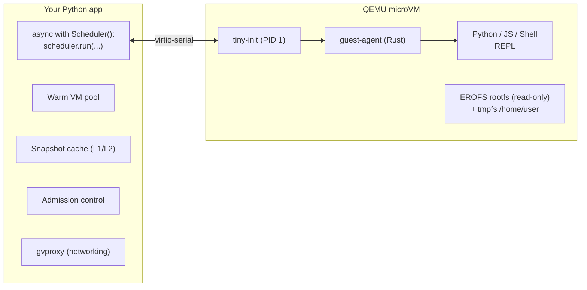

# exec-sandbox

Your AI agent runs untrusted code. One `pip install` gives you hardware-isolated VMs. No cloud account, no API key, no egress fees.

```python
from exec_sandbox import Scheduler

async with Scheduler() as scheduler:
    result = await scheduler.run(
        code="print('Hello from a secure VM!')",
        language="python",  # or "javascript", "raw"
    )
    print(result.stdout)     # Hello from a secure VM!
    print(result.exit_code)  # 0
```

[](https://github.com/dualeai/exec-sandbox/actions/workflows/test.yml)
[](https://codecov.io/gh/dualeai/exec-sandbox)
[](https://pypi.org/project/exec-sandbox/)
[](https://pypi.org/project/exec-sandbox/)
[](https://opensource.org/licenses/Apache-2.0)

## Installation

```bash
uv add exec-sandbox              # Core library
uv add "exec-sandbox[s3]"        # + S3 snapshot caching
```

```bash
# Install QEMU runtime
brew install qemu                # macOS
apt install qemu-system          # Ubuntu/Debian
```

## Why exec-sandbox

**The problem.** AI agents generate and execute code. Containers share the host kernel — one exploit and your infrastructure is compromised. Cloud sandboxes send your data to someone else's servers. You need hardware-level isolation that runs on your own machines.

**The solution.** exec-sandbox runs each Python, JavaScript, or shell execution in a dedicated QEMU microVM with hardware virtualization (KVM on Linux, HVF on macOS). The VM boots, runs code, and is destroyed. No state leaks between executions. No cloud dependency. 9 layers of security isolation, from a custom hardened kernel to socket-level process authentication.

### Highlights

- **Hardware isolation** — Each execution runs in a dedicated lightweight VM (QEMU with KVM/HVF hardware acceleration), not containers
- **1-2ms warm start** — Pre-booted VM pool. ~100ms from memory snapshot. ~400ms cold boot (+ interpreter startup, amortized by L1 cache)
- **Self-hosted** — Runs on your hardware. No cloud account, no API key, no data leaving your network
- **macOS + Linux** — Develop locally on Mac (HVF), deploy on Linux (KVM). Most VM-based alternatives are Linux-only
- **Simple API** — `run()` for one-shot execution, `session()` for stateful multi-step workflows with file I/O; plus `sbx` CLI
- **3-tier snapshot cache** — L1 memory snapshots (~100ms, interpreter warm), L2 disk snapshots (packages cached), L3 S3 remote cache for fleet sharing
- **Network control** — Internet disabled by default. Opt-in with domain allowlisting and defense-in-depth filtering
- **Streaming output** — See results as code runs, don't wait for completion
- **Memory optimization** — Run more VMs per host with automatic compression and idle reclamation

## Quick Start

### CLI

The `sbx` command provides quick access to sandbox execution from the terminal:

```bash
# Run Python code
sbx run 'print("Hello from sandbox")'

# Run JavaScript
sbx run -l javascript 'console.log("Hello from sandbox")'

# Run a file (language auto-detected from extension)
sbx run script.py
sbx run app.js

# With packages
sbx run -p requests==2.32.5 -p pandas==3.0.1 'import pandas; print(pandas.__version__)'

# Enable network with domain allowlist
sbx run --network --allow-domain api.example.com fetch_data.py
```

**CLI Options:**

| Option | Short | Description | Default |
|--------|-------|-------------|---------|
| `--language` | `-l` | python, javascript, raw | auto-detect |
| `--code` | `-c` | Inline code (repeatable, alternative to positional) | - |
| `--package` | `-p` | Package to install (repeatable) | - |
| `--timeout` | `-t` | Timeout in seconds | 30 |
| `--memory` | `-m` | Memory in MB | 192 |
| `--env` | `-e` | Environment variable KEY=VALUE (repeatable) | - |
| `--network` | | Enable network access | false |
| `--allow-domain` | | Allowed domain (repeatable) | - |
| `--expose` | | Expose port `INTERNAL[:EXTERNAL][/PROTOCOL]` (repeatable) | - |
| `--json` | | JSON output | false |
| `--quiet` | `-q` | Suppress progress output | false |
| `--no-validation` | | Skip package allowlist validation | false |
| `--upload` | | Upload file `LOCAL:GUEST` (repeatable) | - |
| `--download` | | Download file `GUEST:LOCAL` or `GUEST` (repeatable) | - |
| `--debug` | | Stream kernel/init boot logs to stderr | false |

### Python API

#### Sessions (Stateful Multi-Step)

Sessions keep a VM alive across multiple `exec()` calls — variables, imports, and state persist.

```python
from exec_sandbox import Scheduler

async with Scheduler() as scheduler:
    async with await scheduler.session(language="python") as session:
        await session.exec("import math")
        await session.exec("x = math.pi * 2")
        result = await session.exec("print(f'{x:.4f}')")
        print(result.stdout)  # 6.2832
        print(session.exec_count)  # 3
```

Sessions support all three languages:

```python
# JavaScript/TypeScript — variables and functions persist
async with await scheduler.session(language="javascript") as session:
    await session.exec("const greet = (name: string): string => `Hello, ${name}!`")
    result = await session.exec("console.log(greet('World'))")

# Shell (Bash) — env vars, cwd, and functions persist
async with await scheduler.session(language="raw") as session:
    await session.exec("cd /tmp && export MY_VAR=hello")
    result = await session.exec("echo $MY_VAR from $(pwd)")
```

Sessions auto-close after idle timeout (default: 300s, configurable via `session_idle_timeout_seconds`).

#### File I/O

Sessions support reading, writing, and listing files inside the sandbox.

```python
import io
from pathlib import Path
from exec_sandbox import Scheduler

async with Scheduler() as scheduler:
    async with await scheduler.session(language="python") as session:
        # Write from bytes, a local Path, or any IO[bytes] stream
        await session.write_file("input.csv", b"name,score\nAlice,95\nBob,87")
        await session.write_file("model.pkl", Path("./local_model.pkl"))
        await session.write_file("data.bin", io.BytesIO(b"in-memory"))

        # Execute code that reads input and writes output
        await session.exec("data = open('input.csv').read().upper()")
        await session.exec("open('output.csv', 'w').write(data)")

        # Read to a local Path or any IO[bytes] buffer
        await session.read_file("output.csv", destination=Path("./output.csv"))
        buf = io.BytesIO()
        await session.read_file("data.bin", destination=buf)

        # List files in a directory
        files = await session.list_files("")  # sandbox root
        for f in files:
            print(f"{f.name} {'dir' if f.is_dir else f'{f.size}B'}")
```

CLI file I/O uses sessions under the hood:

```bash
# Upload a local file, run code, download the result
sbx run --upload ./local.csv:input.csv --download output.csv:./result.csv \
  -c "open('output.csv','w').write(open('input.csv').read().upper())"

# Download to ./output.csv (shorthand, no local path)
sbx run --download output.csv -c "open('output.csv','w').write('data')"
```

#### With Packages

First run installs and creates a snapshot; subsequent runs restore from L1 memory cache in ~100ms.

```python
async with Scheduler() as scheduler:
    result = await scheduler.run(
        code="import pandas; print(pandas.__version__)",
        language="python",
        packages=["pandas==2.2.0", "numpy==1.26.0"],
    )
    print(result.stdout)  # 2.2.0
```

#### Error Handling

```python
from exec_sandbox import (
    Scheduler,
    InputValidationError,
    PackageNotAllowedError,
    SandboxError,
    VmTimeoutError,
    VmTransientError,
)

async with Scheduler() as scheduler:
    try:
        result = await scheduler.run(code="print('hello')", language="python", timeout_seconds=5)

        # Execution timeouts are NOT exceptions — they return a result with exit_code=-1.
        if result.exit_code == -1:
            print(f"Code timed out: {result.stderr}")

    except InputValidationError as e:
        # Caller bug — bad code or env vars. Fix input and retry.
        # (CodeValidationError, EnvVarValidationError inherit from this)
        print(f"Invalid input: {e}")
    except VmTimeoutError:
        # VM failed to boot (guest agent not ready). Often transient (CPU contention).
        print("VM boot timed out — retry may succeed")
    except VmTransientError:
        # Infrastructure failure (QEMU crash, REPL spawn OOM) — code never ran, safe to retry.
        # VmTimeoutError is a subclass, so this must come after it.
        print("Transient VM failure, retry may succeed")
    except PackageNotAllowedError as e:
        print(f"Package not in allowlist: {e}")
    except SandboxError as e:
        print(f"Sandbox error: {e}")
```

## How It Works



> Created fresh. Destroyed after.

1. `Scheduler` boots a lightweight QEMU microVM (or grabs one from the warm pool in 1-2ms)
2. A Rust guest-agent inside the VM receives code over virtio-serial and runs it in a sandboxed REPL
3. stdout/stderr stream back in real-time. Files can be read/written. Ports can be forwarded.
4. The VM is destroyed. No state persists. Next `run()` gets a fresh VM.

For stateful workflows, `session()` keeps the VM alive — variables, imports, and functions persist across `exec()` calls.

## Advanced Usage

### Streaming Output

```python
async with Scheduler() as scheduler:
    result = await scheduler.run(
        code="for i in range(5): print(i)",
        language="python",
        on_stdout=lambda chunk: print(f"[OUT] {chunk}", end=""),
        on_stderr=lambda chunk: print(f"[ERR] {chunk}", end=""),
    )
```

### Boot Log Streaming

Stream kernel, tiny-init, and guest-agent boot output for diagnostics:

```python
async with Scheduler() as scheduler:
    boot_lines: list[str] = []
    result = await scheduler.run(
        code="print('hello')",
        language="python",
        on_boot_log=boot_lines.append,  # Automatically enables verbose boot
    )
    for line in boot_lines:
        print(f"[boot] {line}")
```

### Network Access

```python
async with Scheduler() as scheduler:
    result = await scheduler.run(
        code="import urllib.request; print(urllib.request.urlopen('https://httpbin.org/ip').read())",
        language="python",
        allow_network=True,
        allowed_domains=["httpbin.org"],  # Domain allowlist
    )
```

### Port Forwarding

Expose VM ports to the host for health checks, API testing, or service validation.

```python
from exec_sandbox import Scheduler, PortMapping

async with Scheduler() as scheduler:
    # Port forwarding without internet (isolated)
    result = await scheduler.run(
        code="print('server ready')",
        language="python",
        expose_ports=[PortMapping(internal=8080, external=3000)],  # Guest:8080 → Host:3000
        allow_network=False,  # No outbound internet
    )
    print(result.exposed_ports[0].url)  # http://127.0.0.1:3000

    # Dynamic port allocation (OS assigns external port)
    result = await scheduler.run(
        code="print('server ready')",
        language="python",
        expose_ports=[8080],  # external=None → OS assigns port
    )
    print(result.exposed_ports[0].external)  # e.g., 52341

    # Long-running server with port forwarding
    result = await scheduler.run(
        code="import http.server; http.server.test(port=8080, bind='0.0.0.0')",
        language="python",
        expose_ports=[PortMapping(internal=8080)],
        timeout_seconds=60,  # Server runs until timeout
    )
```

**Security:** Port forwarding works independently of internet access. When `allow_network=False`, guest VMs cannot initiate outbound connections (all outbound TCP/UDP blocked), but host-to-guest port forwarding still works.

## Configuration

```python
from exec_sandbox import Scheduler, SchedulerConfig

config = SchedulerConfig(
    warm_pool_size=1,            # Pre-started VMs per language (0 disables)
    default_memory_mb=512,       # Per-VM memory
    default_timeout_seconds=60,  # Execution timeout
    s3_bucket="my-snapshots",    # Remote cache for package snapshots
    s3_region="us-east-1",
)

async with Scheduler(config) as scheduler:
    result = await scheduler.run(...)
```

| Parameter | Default | Description |
|-----------|---------|-------------|
| `warm_pool_size` | 0 | Pre-started VMs per language (Python, JavaScript, Raw). Set >0 to enable |
| `default_memory_mb` | 192 | VM memory (128 MB minimum, no upper bound). Effective ~25% higher with memory compression (zram) |
| `default_timeout_seconds` | 30 | Execution timeout (1-300s) |
| `session_idle_timeout_seconds` | 300 | Session idle timeout (10-3600s). Auto-closes inactive sessions |
| `images_dir` | auto | VM images directory |
| `disk_snapshot_cache_dir` | OS cache dir | Local disk snapshot cache (macOS: `~/Library/Caches/exec-sandbox/disk-snapshots/`, Linux: `~/.cache/exec-sandbox/disk-snapshots/`) |
| `memory_snapshot_cache_dir` | OS cache dir | Local memory snapshot cache (macOS: `~/Library/Caches/exec-sandbox/memory-snapshots/`, Linux: `~/.cache/exec-sandbox/memory-snapshots/`) |
| `s3_bucket` | None | S3 bucket for remote snapshot cache |
| `s3_region` | us-east-1 | AWS region |
| `s3_prefix` | snapshots/ | Prefix for S3 keys |
| `max_concurrent_s3_uploads` | 4 | Max concurrent background S3 uploads (1-16) |
| `memory_overcommit_ratio` | 5.0 | Memory overcommit ratio. Budget = host_total × (1 - reserve) × ratio |
| `cpu_overcommit_ratio` | 2.0 | CPU overcommit ratio. Budget = (host_cpus - reserve) × ratio |
| `host_memory_reserve_ratio` | 0.1 | Fraction of host memory reserved for OS (e.g., 0.1 = 10%) |
| `host_cpu_reserve_cores` | 0.5 | CPU cores reserved for host processes (fixed, not a ratio) |
| `enable_package_validation` | True | Validate against top 10k packages (PyPI for Python, npm for JavaScript) |
| `auto_download_assets` | True | Auto-download VM images from GitHub Releases |

Environment variables: `EXEC_SANDBOX_IMAGES_DIR`, `EXEC_SANDBOX_CACHE_DIR`, `EXEC_SANDBOX_OFFLINE`, etc.

## Performance

Measured on a 16-vCPU / 32 GB EC2 instance (Intel Xeon 6975P, KVM, Debian 13) using a mixed workload of Python, JavaScript, and shell commands.

### Concurrent Throughput

250 VMs per config, 16 overcommit combos. **Admission** = queue wait, **Setup** = overlay + cgroup, **Exec** = VM boot + code run:

| Config | VMs/s | Admit p50/p95 | Setup p50/p95 | Exec p50/p95 | Total p50/p95 | Peak RSS | Efficiency |
|--------|-------|---------------|---------------|--------------|---------------|----------|------------|
| CPU=2x MEM=5x (default) | **66.8** | 1.5s / 3.0s | 83ms / 160ms | 132ms / 188ms | **1.8s / 3.3s** | 1.1 GB (3.4%) | 2223 |
| CPU=2x MEM=3x | 66.7 | 1.5s / 3.0s | 84ms / 163ms | 134ms / 193ms | 1.8s / 3.3s | 1.0 GB (3.2%) | 2201 |
| CPU=4x MEM=5x | 63.9 | 1.4s / 2.7s | 221ms / 719ms | 170ms / 336ms | 1.9s / 3.2s | 1.9 GB (5.9%) | 1159 |
| CPU=8x MEM=5x | 47.8 | 1.4s / 2.6s | 505ms / 768ms | 296ms / 783ms | 2.6s / 3.5s | 3.9 GB (12.4%) | 857 |
| CPU=12x MEM=1.5x | 4.0 | 0s / 17.1s | 12.9s / 31.1s | 1.9s / 37.8s | 50.9s / 52.8s | 11.6 GB (36.9%) | 37 |

Exec latency is only 132ms p50 at the optimal config — admission dominates under burst load. **Efficiency** = 10⁶ / geomean(admission, setup, exec) p95; higher is better. 13/16 configs achieved 100% success (3,151/4,000 VMs).

> **Production sizing.** The 3s admission p95 is specific to this stress test (250 VMs on ~24 slots). When `concurrent_requests ≤ max_slots`, admission is **0ms**. Scale horizontally — add hosts so that `max_slots ≥ peak_concurrency`, don't increase overcommit.
>
> **Local/desktop tuning.** The defaults (CPU=2x, MEM=5x) were optimized via RBF surrogate on production KVM hosts. On a desktop (macOS HVF or fewer cores), run `make bench-optimizer` to find the optimal values for your hardware.

### Single VM Latency

| Path | Time to First Exec |
|------|--------------------|
| Warm pool hit | 1-2ms |
| L1 memory snapshot | ~100ms |
| Cold boot (KVM) | ~400ms boot + 4-5s REPL |
| Cold boot (HVF/macOS) | ~400ms boot + 4-11s REPL |

### Tuning

Re-run the optimizer after changing VM sizing, admission logic, or target hardware:

```bash
make bench-optimizer              # 200 VMs per combo (4x4 grid = 16 combos)
make bench-optimizer N_VMS=250    # heavier load (recommended for tuning)
```

## Memory Optimization

VMs include automatic memory optimization (no configuration required):

- **Compressed swap (zram)** - ~25% more usable memory via lz4 compression
- **Memory reclamation (virtio-balloon)** - Reclaims unused guest pages on idle warm-pool VMs (192→140 MB default), reducing host memory pressure

### Memory Architecture

Guest RAM is a fixed budget shared between the kernel, userspace processes, and tmpfs mounts. tmpfs is demand-allocated — writing 10 MB of files consumes ~10 MB of the VM's memory budget. All tmpfs mounts enforce per-UID quota (`usrquota_block_hardlimit`) to prevent sparse file inflation attacks.

```
Guest RAM (default 192 MB)
├── Kernel + slab caches     (~20 MB fixed)
├── Userspace (code execution) (variable)
├── tmpfs mounts (on demand, per-UID quota)
│   ├── /home/user           40% of RAM — user files, packages
│   ├── /tmp                 50% of RAM — pip/uv wheel builds, temp files
│   └── /dev/shm             40% of RAM — POSIX shared memory
└── zram compressed swap     (40% disksize, 20% mem_limit)
```

| Mount | Size | Purpose |
|---|---|---|
| `/home/user` | 40% of RAM | Writable home dir — installed packages, user scripts, data files |
| `/tmp` | 50% of RAM | Scratch space for package managers (wheel builds), temp files |
| `/dev/shm` | 40% of RAM | POSIX shared memory segments (Python multiprocessing semaphores) |

## Design Trade-offs

Optimized for AI agent workloads: long-lived but mostly idle sessions, high concurrency, untrusted code.

### Why QEMU over alternatives

| Approach | Trade-off |
|----------|-----------|
| **Containers** (Docker, K8s pods) | Shared host kernel — container escapes are a proven, recurring class: [CVE-2019-5736](https://nvd.nist.gov/vuln/detail/CVE-2019-5736) (runc), [CVE-2024-21626](https://nvd.nist.gov/vuln/detail/CVE-2024-21626) (runc "Leaky Vessels"), [CVE-2022-0185](https://nvd.nist.gov/vuln/detail/CVE-2022-0185) (user namespace). VMs run their own kernel, eliminating this class. Remaining surface is the [hypervisor device model](https://venom.crowdstrike.com/) |
| **gVisor** | User-space kernel ([Sentry](https://gvisor.dev/docs/architecture_guide/security/)), not a hardware boundary. A Sentry bug exposes the host. Incomplete syscall coverage breaks some workloads |
| **Firecracker** | Genuine VM isolation (powers AWS Lambda, [E2B](https://e2b.dev)). But [requires KVM](https://github.com/firecracker-microvm/firecracker/blob/main/docs/getting-started.md) — no macOS, no software emulation fallback. Many cloud VMs and containerized environments don't expose nested virtualization |
| **Cloud sandboxes** | Data leaves your network. Per-execution pricing. Vendor lock-in |
| **Namespace isolation** (Bubblewrap, nsjail) | No hardware boundary — host kernel processes all syscalls directly |

QEMU/KVM: [in the Linux kernel since 2007](https://kernelnewbies.org/Linux_2_6_20), powers [Google Cloud](https://cloud.google.com/blog/products/gcp/7-ways-we-harden-our-kvm-hypervisor-at-google-cloud-security-in-plaintext) and [AWS Nitro](https://perspectives.mvdirona.com/2019/02/aws-nitro-system/). exec-sandbox uses KVM on Linux, HVF on macOS, and falls back to software emulation (TCG) when neither is available — deploy on bare metal, cloud VMs, or inside containers without nested virtualization. The trade-off is complexity: cross-platform support (KVM/HVF/TCG × x86_64/aarch64) requires careful engineering.

### Optimized for sandbox density, not raw performance

AI agent sandboxes are long-lived (hours) but mostly idle — typical code bursts every 30s to 5 min, each lasting seconds. **Sandbox density** (VMs per GB) matters more than per-VM performance.

Memory optimizations maximize VMs per host: COW template memory (x-ignore-shared VM templating — L1 snapshots save 350KB device state, restored VMs share RAM pages via MAP_PRIVATE), free page reporting, KSM page dedup (Linux), cgroup memory.reclaim, zram compression, and virtio-balloon reclamation. Trade-off: template VMs cannot use balloon (incompatible with file-backed COW); cold-boot VMs retain balloon.

### Why not Kubernetes for sandbox orchestration

Kubernetes targets long-running services, not high-churn ephemeral workloads. At scale, pod lifecycle hits [etcd throughput](https://etcd.io/docs/v3.5/op-guide/performance/), [scheduler limits (~100-200 pods/s)](https://github.com/kubernetes/community/blob/master/sig-scalability/slos/slos.md), and [cluster ceiling (~150k pods)](https://kubernetes.io/docs/setup/best-practices/cluster-large/). [Knative](https://knative.dev/) and [agent-sandbox](https://agent-sandbox.sigs.k8s.io/) help, but each sandbox still pays the full pod lifecycle cost with multiple etcd writes per transition.

exec-sandbox manages VMs directly as processes — no orchestration layer. A single host sustains [39 VMs/s](#concurrent-throughput) with sub-second setup.

## Snapshot Caching Architecture

exec-sandbox uses a 3-tier snapshot cache to eliminate redundant work across executions. The first run with a given configuration pays the full cost (boot + package install); every subsequent run restores from cache.

```
Request arrives
│
├─ Warm pool hit? ──────────────── 1-2ms     (pre-started VM, REPL already warm)
│
├─ L1 memory snapshot? ────────── ~100ms     (full VM state restore — REPL already warm)
│
├─ L2 disk snapshot? ──────────── ~400ms boot + 4-11s REPL startup
│                                             (packages cached, but interpreter cold-starts)
│
├─ L3 S3 remote cache? ────────── download + same as L2
│
└─ Cold miss ──────────────────── ~400ms boot + 4-11s REPL + package install
```

### L1: Memory Snapshots

L1 captures the complete VM state — CPU registers, RAM pages, device state — via QEMU's [migration subsystem](https://www.qemu.org/docs/master/devel/migration/main.html). Restoring from L1 resumes the VM exactly where it was, with REPL already warm and packages loaded. No boot, no initialization. The guest-agent forces an immediate kernel CRNG reseed (`RNDRESEEDCRNG` ioctl) before every command dispatch, ensuring each restored VM produces unique cryptographic random output despite sharing the same snapshot origin.

On QEMU >= 9.0, exec-sandbox enables [mapped-ram](https://www.qemu.org/docs/master/devel/migration/mapped-ram.html) for fixed-offset page storage (enabling parallel I/O) and [multifd](https://www.qemu.org/docs/master/devel/migration/main.html) for multi-threaded migration channels. Mapped-ram files are sparse — unused RAM pages become filesystem holes. A default 192 MB VM produces a file that appears as ~326 MB (`ls -l`) but consumes only ~50-100 MB of actual disk (Python ~86 MB, JavaScript ~96 MB, raw ~56 MB).

**How L1 saves work:** After a cold boot, exec-sandbox schedules a background save — it boots a sacrificial VM with the same parameters, warms the REPL, saves the migration stream to disk via QMP (`stop` → `migrate` → poll → `quit`), and destroys the VM. The next request with matching parameters restores from the saved vmstate instead of booting.

L1 cache keys include: language, packages, exec-sandbox version, base image hash, QEMU version, CPU architecture, acceleration type, memory size, CPU cores, network topology, migration format version, kernel hash, and initramfs hash. Any parameter change produces a different cache entry.

### L2: Disk Snapshots

L2 stores standalone ext4 qcow2 images with packages pre-installed. When a request needs packages (e.g., `pandas==2.2.0`), exec-sandbox checks L2 for a matching snapshot. On hit, the VM boots with the cached disk overlaid on the read-only EROFS base via overlayfs — skipping package installation but still going through kernel boot (~400ms) and interpreter startup (4-11s for Python/Bun on HVF, ~4-5s on KVM). The snapshot only contains the writable layer (installed packages and their files), not the full rootfs.

This is where L1 matters: L1 snapshots the memory state *after* the interpreter is fully loaded, eliminating the 4-11s REPL startup cost entirely. An L1 save is automatically scheduled after every L2 cold boot, so the interpreter startup penalty is paid only once per unique configuration.

### L3: S3 Remote Cache

L3 extends L2 across machines. When an L2 snapshot is created, it's compressed with zstd and uploaded to S3 in the background. Other hosts can download and decompress it to populate their local L2 cache, avoiding redundant package installations across a fleet.

## API Reference

### Execution Result

| Field | Type | Description |
|-------|------|-------------|
| `stdout` | str | Captured output (max 1MB) |
| `stderr` | str | Captured errors (max 100KB) |
| `exit_code` | int | Process exit code (0 = success, 128+N = killed by signal N) |
| `execution_time_ms` | int \| None | Duration reported by VM |
| `external_cpu_time_ms` | int \| None | CPU time measured by host |
| `external_memory_peak_mb` | int \| None | Peak memory measured by host |
| `external_cpu_nr_throttled` | int \| None | CFS bandwidth throttle events (host cgroup) |
| `timing.setup_ms` | int | Resource setup (filesystem, limits, network) |
| `timing.boot_ms` | int | VM boot time |
| `timing.execute_ms` | int | Code execution |
| `timing.total_ms` | int | End-to-end time |
| `warm_pool_hit` | bool | Whether a pre-started VM was used |
| `exposed_ports` | list | Port mappings with `.internal`, `.external`, `.host`, `.url` |

Exit codes follow Unix conventions: 0 = success, >128 = killed by signal N where N = exit_code - 128 (e.g., 137 = SIGKILL, 139 = SIGSEGV), -1 = execution timeout (code ran too long), other non-zero = program error. Infrastructure failures (QEMU crash, REPL spawn failure) raise `VmTransientError` instead of returning a result.

```python
# Infrastructure failures raise VmTransientError before reaching here (see Error Handling).
result = await scheduler.run(code="...", language="python")

if result.exit_code == 0:
    pass  # Success
elif result.exit_code > 128:
    signal_num = result.exit_code - 128  # e.g., 9 for SIGKILL
elif result.exit_code == -1:
    pass  # Execution timeout (code ran too long, see result.stderr)
else:
    pass  # Program exited with error
```

### FileInfo

Returned by `Session.list_files()`.

| Field | Type | Description |
|-------|------|-------------|
| `name` | str | File or directory name |
| `is_dir` | bool | True if entry is a directory |
| `size` | int | File size in bytes (0 for directories) |

### Exceptions

| Exception | Description |
|-----------|-------------|
| `SandboxError` | Base exception for all sandbox errors |
| `TransientError` | Retryable errors — may succeed on retry |
| `VmTransientError` | Transport failure or guest infrastructure failure (code never ran) |
| `VmTimeoutError` | VM boot timed out |
| `VmCapacityError` | VM pool at capacity |
| `PermanentError` | Non-retryable errors |
| `VmPermanentError` | Protocol/request corruption or invalid VM state |
| `VmConfigError` | Invalid VM configuration |
| `InputValidationError` | Caller-bug errors — bad input, session stays alive |
| `CodeValidationError` | Empty, whitespace-only, or null-byte code |
| `EnvVarValidationError` | Invalid env var names/values (control chars, size) |
| `SessionClosedError` | Session already closed |
| `CommunicationError` | Guest communication failed |
| `GuestAgentError` | Guest agent returned error |
| `PackageNotAllowedError` | Package not in allowlist |
| `SnapshotError` | Snapshot operation failed |
| `SocketAuthError` | Socket peer authentication failed |
| `SandboxDependencyError` | Optional dependency missing (e.g., aioboto3) |
| `AssetError` | Asset download/verification failed |

### Session Resilience

Sessions survive user code failures, input validation errors (`InputValidationError`), and output limit errors (`OutputLimitError`). Only VM-level communication errors close a session.

| Failure | Exit Code | Session | State | Next `exec()` |
|---------|-----------|---------|-------|----------------|
| Exception (ValueError, etc.) | 1 | Alive | Preserved | Works, state intact |
| `sys.exit(n)` | n | Alive | Preserved | Works, state intact |
| Syntax error | 1 | Alive | Preserved | Works, state intact |
| Output limit exceeded | 1 | Alive | Preserved | Works, state intact |
| `os._exit(n)` | n | Alive | **Reset** | Works, fresh REPL |
| Signal (SIGKILL, OOM kill) | 128 + signal | Alive | **Reset** | Works, fresh REPL |
| Timeout | -1 | Alive | **Reset** | Works, fresh REPL |
| VM communication failure | N/A | **Closed** | Lost | `SessionClosedError` |

## Pitfalls

```python
# run() creates a fresh VM each time - state doesn't persist across calls
result1 = await scheduler.run("x = 42", language="python")
result2 = await scheduler.run("print(x)", language="python")  # NameError!
# Fix: use sessions for multi-step stateful execution
async with await scheduler.session(language="python") as session:
    await session.exec("x = 42")
    result = await session.exec("print(x)")  # Works! x persists

# Pre-started VMs (warm pool) only work without packages
config = SchedulerConfig(warm_pool_size=1)
await scheduler.run(code="...", packages=["pandas==2.2.0"])  # Bypasses warm pool, cold boot + install (~100ms after L1 cached)
await scheduler.run(code="...")                        # Uses warm pool (1-2ms)
await scheduler.run(code="...", on_boot_log=print)     # Bypasses warm pool (needs cold boot for logs)

# Version specifiers are required (security + caching)
packages=["pandas==2.2.0"]  # Valid, cacheable
packages=["pandas"]         # PackageNotAllowedError! Must pin version

# Streaming callbacks must be fast (blocks async execution)
on_stdout=lambda chunk: time.sleep(1)        # Blocks!
on_stdout=lambda chunk: buffer.append(chunk)  # Fast (same applies to on_boot_log)

# Memory overhead: pre-started VMs use warm_pool_size × 3 languages × 192MB
# warm_pool_size=5 → 5 VMs/lang × 3 × 192MB = 2.88GB for warm pool alone

# Memory can exceed configured limit due to compressed swap
default_memory_mb=192  # Code can actually use ~210-240MB thanks to compression
# Don't rely on memory limits for security - use timeouts for runaway allocations

# Network without domain restrictions is risky
allow_network=True                              # Full internet access
allow_network=True, allowed_domains=["api.example.com"]  # Controlled

# Port forwarding binds to localhost only
expose_ports=[8080]  # Binds to 127.0.0.1, not 0.0.0.0
# If you need external access, use a reverse proxy on the host

# multiprocessing.Pool works, but single vCPU means no CPU-bound speedup
from multiprocessing import Pool
Pool(2).map(lambda x: x**2, [1, 2, 3])  # Works (cloudpickle handles lambda serialization)
# For CPU-bound parallelism, use multiple VMs via scheduler.run() concurrently instead

# Background processes survive across session exec() calls — state accumulates
async with await scheduler.session(language="python") as session:
    await session.exec("import subprocess; subprocess.Popen(['sleep', '300'])")
    await session.exec("import subprocess; subprocess.Popen(['sleep', '300'])")
    # Both sleep processes are still running! VM process limit (RLIMIT_NPROC=1024) prevents unbounded growth
    # All processes are cleaned up when session.close() destroys the VM
```

## Limits

| Resource | Limit |
|----------|-------|
| Max code size | 1MB |
| Max stdout | 1MB |
| Max stderr | 100KB |
| Max packages | 50 |
| Max env vars | 100 |
| Max exposed ports | 10 |
| Max file size (I/O) | 500MB |
| Max file path length | 4096 bytes (255 per component) |
| Execution timeout | 1-300s |
| VM memory | 128MB minimum (no upper bound) |
| Max concurrent VMs | Resource-aware (auto-computed from host memory + CPU) |

## Security Architecture

| Layer | Technology | Protection |
|-------|------------|------------|
| 1 | Hardware virtualization (KVM/HVF) | CPU isolation enforced by hardware |
| 2 | Custom hardened kernel | Modules disabled at compile time, [io_uring](https://security.googleblog.com/2023/06/learnings-from-kctf-vrps-42-linux.html) and eBPF compiled out, slab/memory hardening, ~360+ subsystems removed |
| 3 | Unprivileged QEMU | No root privileges, minimal exposure |
| 4 | Non-root REPL (UID 1000) | Blocks mount, ptrace, raw sockets, kernel modules |
| 5 | System call filtering (seccomp) | Blocks unauthorized OS calls |
| 6 | Resource limits (cgroups v2) | Memory, CPU, process limits |
| 7 | Process isolation (namespaces) | Separate process, network, filesystem views |
| 8 | Security policies (AppArmor/SELinux) | When available |
| 9 | Socket authentication (SO_PEERCRED/LOCAL_PEERCRED) | Verifies QEMU process identity |

**Guarantees:**

- Fresh VM per `run()`, destroyed immediately after. Sessions reuse the same VM across `exec()` calls (same isolation, persistent state)
- Network disabled by default - requires explicit `allow_network=True`
- Domain allowlisting with 3-layer outbound filtering — DNS resolution blocked for non-allowed domains, TLS SNI inspection on port 443, and DNS cross-validation to prevent SNI spoofing
- Package validation - only top 10k Python/JavaScript packages allowed by default
- Port forwarding isolation - when `expose_ports` is used without `allow_network`, guest cannot initiate any outbound connections (all outbound TCP/UDP blocked)

## VM Images

Pre-built images from [GitHub Releases](https://github.com/dualeai/exec-sandbox/releases):

| Image | Runtime | Package Manager | Size | Description |
|-------|---------|-----------------|------|-------------|
| `python-3.14-base` | Python 3.14 | uv | ~75MB | Full Python environment |
| `node-1.3-base` | Bun 1.3 | bun | ~57MB | Fast JavaScript/TypeScript runtime with Node.js compatibility |
| `raw-base` | Bash | None | ~15MB | Shell scripts and custom runtimes |

All images are based on **Alpine Linux 3.23** (Linux 6.18, musl libc) and include common tools for AI agent workflows.

### Common Tools (all images)

| Tool | Purpose |
|------|---------|
| `git` | Version control, clone repositories |
| `curl` | HTTP requests, download files |
| `jq` | JSON processing |
| `bash` | Shell scripting |
| `coreutils` | Standard Unix utilities (ls, cp, mv, etc.) |
| `grep` | GNU grep (PCRE via `-P`, `--include`, etc.) |
| `findutils` | GNU find (`-printf`, `-regex`, etc.) |
| `sed` | GNU sed (in-place editing, extended regex) |
| `gawk` | GNU awk (`gensub`, `strftime`, FPAT, etc.) |
| `diffutils` | GNU diff/diff3/sdiff (`--color`, unified format) |
| `patch` | Apply unified diffs |
| `less` | Pager (backward scroll, search) |
| `make` | Build automation |
| `tree` | Directory structure visualization |
| `tar`, `gzip`, `unzip` | Archive extraction |
| `file` | File type detection |

### Python Image

| Component | Version | Notes |
|-----------|---------|-------|
| Python | 3.14 | [python-build-standalone](https://github.com/astral-sh/python-build-standalone) (musl) |
| uv | 0.9+ | 10-100x faster than pip ([docs](https://docs.astral.sh/uv/)) |
| cloudpickle | 3.1.2 | Serialization for `multiprocessing` in REPL ([docs](https://github.com/cloudpipe/cloudpickle)) |

**Usage notes:**

- Use `uv pip install` instead of `pip install` (pip not included)
- Only prebuilt wheels are supported — packages without `cp314` `musllinux` wheels will fail instantly. No source builds (gcc/musl-dev not included; see [python-build-standalone#684](https://github.com/astral-sh/python-build-standalone/issues/684))
- Python 3.14 includes t-strings and deferred annotations
- `multiprocessing.Pool` works out of the box — cloudpickle handles serialization of REPL-defined functions, lambdas, and closures. Single vCPU means no CPU-bound speedup, but I/O-bound parallelism and `Pool`-based APIs work correctly

### JavaScript Image

| Component | Version | Notes |
|-----------|---------|-------|
| Bun | 1.3 | Runtime, bundler, package manager ([docs](https://bun.com/docs)) |

**Usage notes:**

- Bun is a Node.js-compatible runtime (not Node.js itself)
- Built-in TypeScript/JSX support, no transpilation needed
- Use `bun install` for packages, `bun run` for scripts
- Near-complete Node.js API compatibility

### Raw Image

Minimal Alpine Linux with common tools only. Use for:

- Shell script execution (`language="raw"`) — runs under **GNU Bash**, full bash syntax supported
- Custom runtime installation
- Lightweight workloads

Build from source:

```bash
./scripts/build-images.sh
# Output: ./images/dist/python-3.14-base-{arch}.qcow2, ./images/dist/node-1.3-base-{arch}.qcow2, ./images/dist/raw-base-{arch}.qcow2
```

## Asset Downloads

exec-sandbox requires VM images (kernel, initramfs, qcow2) and binaries (gvproxy-wrapper) to run. These assets are **automatically downloaded** from GitHub Releases on first use.

### How it works

1. On first `Scheduler` initialization, exec-sandbox checks if assets exist in the cache directory
2. If missing, it queries the GitHub Releases API for the matching version (`v{__version__}`)
3. Assets are downloaded over HTTPS, verified against SHA256 checksums (provided by GitHub API), and decompressed
4. Subsequent runs use the cached assets (no re-download)

### Cache locations

| Platform | Location |
|----------|----------|
| macOS | `~/Library/Caches/exec-sandbox/` |
| Linux | `~/.cache/exec-sandbox/` (or `$XDG_CACHE_HOME/exec-sandbox/`) |

### Environment variables

| Variable | Description |
|----------|-------------|
| `EXEC_SANDBOX_CACHE_DIR` | Override cache directory |
| `EXEC_SANDBOX_OFFLINE` | Set to `1` to disable auto-download (fail if assets missing) |
| `EXEC_SANDBOX_ASSET_VERSION` | Force specific release version |
| `EXEC_SANDBOX_LOG_LEVEL` | Set log level (`DEBUG`, `INFO`, `WARNING`, `ERROR`) |

### Pre-downloading for offline use

Use `sbx prefetch` to download all assets ahead of time:

```bash
sbx prefetch                    # Download all assets for current arch
sbx prefetch --arch aarch64     # Cross-arch prefetch
sbx prefetch -q                 # Quiet mode (CI/Docker)
```

**Dockerfile example:**

```dockerfile
FROM ghcr.io/astral-sh/uv:python3.12-bookworm
RUN uv pip install --system exec-sandbox
RUN sbx prefetch -q
ENV EXEC_SANDBOX_OFFLINE=1
# Assets cached, no network needed at runtime
```

### Security

Assets are verified against SHA256 checksums and built with [provenance attestations](https://docs.github.com/en/actions/security-guides/using-artifact-attestations-to-establish-provenance-for-builds).

## Requirements

| Requirement | Supported |
|-------------|-----------|
| Python | 3.12, 3.13, 3.14 (including free-threaded) |
| Linux | x64, arm64 |
| macOS | x64, arm64 |
| QEMU | 8.0+ |
| Hardware acceleration | KVM (Linux) or HVF (macOS) recommended, ~5-8x faster |

Verify hardware acceleration is available:

```bash
ls /dev/kvm              # Linux
sysctl kern.hv_support   # macOS
```

Without hardware acceleration, QEMU uses software emulation (TCG), which is ~5-8x slower.

### Linux Setup (Optional Security Hardening)

For enhanced security on Linux, exec-sandbox can run QEMU as an unprivileged `qemu-vm` user. This isolates the VM process from your user account.

```bash
# Create qemu-vm system user
sudo useradd --system --no-create-home --shell /usr/sbin/nologin qemu-vm

# Add qemu-vm to kvm group (for hardware acceleration)
sudo usermod -aG kvm qemu-vm

# Add your user to qemu-vm group (for socket access)
sudo usermod -aG qemu-vm $USER

# Re-login or activate group membership
newgrp qemu-vm
```

**Why is this needed?** When `qemu-vm` user exists, exec-sandbox runs QEMU as that user for process isolation. The host needs to connect to QEMU's Unix sockets (0660 permissions), which requires group membership. This follows the [libvirt security model](https://wiki.archlinux.org/title/Libvirt).

If `qemu-vm` user doesn't exist, exec-sandbox runs QEMU as your user (no additional setup required, but less isolated).

## Documentation

- [QEMU Documentation](https://www.qemu.org/docs/master/) - Virtual machine emulator
- [KVM](https://www.linux-kvm.org/page/Documents) - Linux hardware virtualization
- [HVF](https://developer.apple.com/documentation/hypervisor) - macOS hardware virtualization (Hypervisor.framework)
- [cgroups v2](https://docs.kernel.org/admin-guide/cgroup-v2.html) - Linux resource limits
- [seccomp](https://man7.org/linux/man-pages/man2/seccomp.2.html) - System call filtering

## Security

- [Security Policy](./SECURITY.md) - Vulnerability reporting
- [Dependency list (SBOM)](https://github.com/dualeai/exec-sandbox/releases) - Full list of included software, attached to releases

## Contributing

Contributions welcome! Please open an issue first to discuss changes.

```bash
make install      # Setup environment
make test         # Run tests
make lint         # Format and lint
```

## License

[Apache-2.0](https://opensource.org/licenses/Apache-2.0)
